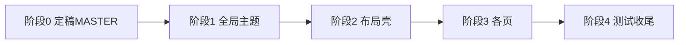

# 全站 UI 改版规格（文档先行）

**状态：** **阶段 3–4 已落地** — 同上改造范围；**阶段 4 质量闸门**（本地）：`pnpm run typecheck`、`pnpm run test:run`、`pnpm run lint`、`pnpm run e2e`（Portal + Admin shell smoke）均已通过。邮件/微信 **示例 HTML** 内色值为模板演示。新页面仍遵守 `MASTER.md` + 本 SPEC；CI 需在流水线中绑定相同命令。  
**范围：** 客户 Portal 与律所 Admin **同一套设计语言**（仅允许密度与信息层级上的差异，不允许第二套主题）。

---

## 1. 为什么先写文档

- 固定 **单一参考** 与 **品牌色不变量**，避免实现阶段各页面分叉。
- 把 **Ant Design Vue 主题/token** 与 **自定义 CSS 变量** 写清楚，减少返工。
- 为 AI 辅助开发提供可引用的 **单一事实来源**（本文件 + 更新后的 `MASTER.md`）。

---

## 2. 唯一主参考（须正式选定）

在下方填定一项后，全站改造均以此为「观感与结构」范本；**不**追求像素级抄袭官网，**不**照搬对方品牌色与 Logo。

| 字段 | 内容 |
|------|------|
| **主参考（awesome-design-md / getdesign.md）** | **Stripe**（`stripe`） |
| **主参考 DESIGN.md 获取方式** | https://getdesign.md/stripe/design-md（或 awesome-design-md 仓库 `design-md/stripe`，以实际下载为准） |
| **全站气质一句话** | 冷静、可信、信息层级清晰；留白与边框干净（Stripe 式 B2B），品牌色为律所蓝 + 琥珀 CTA，**不**使用 Stripe 紫品牌 |

> **实现说明：** 色值映射见 **§5** 与 `MASTER.md`；运行时代码以 `src/styles/theme.css` + `App.vue` 为准。

---

## 3. 不变量（改版也必须保留）

| 项 | 要求 |
|----|------|
| **品牌主色** | 保持律所识别（具体 hex 以定稿 `MASTER.md` 为准）。若 `MASTER.md` 与当前 `App.vue`/`theme.css` 不一致，按 **§7** 在 **同一 PR** 内对齐文档与代码。 |
| **技术栈** | Vue 3 + Vite + **Ant Design Vue**；改版以 `ConfigProvider` / Less 变量 / 局部 CSS 为主，不更换组件库。 |
| **可访问性** | 继承 `MASTER.md` 中对比度、焦点态、`prefers-reduced-motion` 等要求。 |
| **覆盖规则** | 具体页面若存在 `design-system/pages/[page].md`，仍优先于 `MASTER.md`；**本 REDESIGN-SPEC 仅在与页面文档冲突时，以评审结论为准**。 |

---

## 4. 文档层级（维护时）

1. **`REDESIGN-SPEC.md`（本文件）** — 目标、范围、阶段记录、参考、验收结论。
2. **`MASTER.md`** — 全站 token、组件规则、禁忌；应与 **`App.vue` + `theme.css` 运行值** 同步演进。
3. **`design-system/pages/*.md`** — 单页特例（尽量少用，避免「不统一」）。

新功能或改 UI 时：同时对照 **本 SPEC + 当前 `MASTER.md`**。

---

## 5. 从主参考到本项目的「翻译表」（在 `MASTER.md` 中落地）

改版前在本节补全具体数值；主参考文档中的色值 **不得** 直接当品牌色，应映射到下列角色：

| 语义角色 | 本项目（当前基线） | 改版后（阶段 1 已定） | 备注 |
|----------|-------------------|----------------------|------|
| Primary | `#1E40AF` | `#1E40AF` | Ant `colorPrimary`、`--lex-primary-soft` |
| Secondary | `#3B82F6` | `#3B82F6` | Ant `colorInfo` |
| CTA / Accent | `#F59E0B` | `#F59E0B` | 主按钮 `.ant-btn-primary`、`--lex-accent` |
| 背景页 | `#F8FAFC` | `#F8FAFC` | `--lex-bg` |
| 标题强调色 | `#1E3A8A` | `#1E3A8A` | `--lex-primary` |
| 正文色 | — | `#0F172A` | `--lex-text`（Stripe 式深灰正文） |
| 边框 / 分割线 | `#E2E8F0` | `#E2E8F0` | `--lex-outline` |
| 危险 / 错误 | — | `#DC2626` | Ant `colorError` |
| Admin 侧栏底 | — | `#0F172A` | Ant `Layout.siderBg` |

**字体：** **Fira Sans**（标题 + 正文）+ **Fira Code**（等宽）；已与 `theme.css` / `App.vue` 对齐。

**圆角 / 阴影 / 间距：** 基础圆角 **6–10px**、阴影见 `theme.css`；间距沿用 `--spacing-*` 与 Ant 控件高度 **40px**（阶段 1）。

---

## 6. Ant Design Vue 对接（实现阶段检查清单）

- [x] 全局 **`ConfigProvider`**（`App.vue`）已覆盖：`colorPrimary`、`colorBgBase`、`borderRadius`、`fontFamily`、Layout / Table / Menu 等组件 token。
- [x] **管理端列表表格** `size="small"`；**Modal / Drawer / `ant-layout-content` 内纵向表单**（非 `inline`）表单项间距 **16px**（`style.css`）；Menu 密度仍由 `App.vue` token 约束，不引入第二套色板。
- [x] **图标：** 界面使用 `@ant-design/icons-vue`；未发现用 emoji 充当图标；模板内的 HTML 字符串（如邮件预览）不视为 UI 图标集。

---

## 7. Token 源与维护规则（已定稿）

**单一事实来源：** 运行中主题以 **`App.vue`（ConfigProvider）+ `theme.css`（`--lex-*` 等）** 为准；`MASTER.md` / 本 SPEC 为 **人类与 Agent 读的规范**，变更时应 **同一 PR** 与代码对齐。

| 位置 | 职责 | 维护时注意 |
|------|------|------------|
| `frontend/design-system/law-firm-clients/MASTER.md` | 色板、字体、禁忌、页面文案层级 | 与 `App.vue` / `theme.css` 数值冲突时以代码为准并回写文档 |
| `frontend/src/App.vue` | `theme.token` / `theme.components` | 改主色、圆角、组件级 token 时同步 `MASTER.md` |
| `frontend/src/styles/theme.css` | `:root` 变量，供自定义布局与非 Ant 节点使用 | 语义与 Ant token 保持一致 |
| `frontend/src/style.css` | 全局 Ant 覆盖、Portal/Admin 共用工具类 | 避免再引入硬编码品牌色；优先变量 |

---

## 8. 改造范围（视图清单）

### 客户侧（Portal）

| 路由/功能 | 视图文件 |
|-----------|----------|
| 门户入口 | `views/Portal.vue` |
| 项目列表 / 详情 | `views/ClientMatterList.vue`, `views/MatterDetail.vue` |
| 文件中心 | `views/ClientFileList.vue` |
| 消息通知 | `views/ClientNotifications.vue` |
| 个人中心 | `views/ClientProfile.vue` |
| 帮助中心 | `views/HelpCenter.vue` |
| 函件验证 | `views/verify/LetterVerify.vue` |

### 管理端（Admin）

| 区域 | 视图文件（在 `views/admin/`） |
|------|--------------------------------|
| 布局与登录 | `AdminLayout.vue`, `Login.vue` |
| 初始化与系统 | `InitialSetup.vue`, `SystemInfo.vue`, `SystemMaintenance.vue`, `SystemConfig.vue` |
| 项目 | `MatterList.vue`, `MatterDetail.vue` |
| 通知 | `NotificationHistory.vue`, `NotificationSettings.vue`, `NotificationTemplateManagement.vue` |
| 文件与验证 | `FileManagement.vue`, `LetterVerificationList.vue` |
| 其他 | `ApiKeyManagement.vue`, `AdminProfile.vue` |

### 共享组件与布局（优先统一）

| 路径 | 用途 |
|------|------|
| `src/components/AppHeader.vue` | Portal 顶栏 |
| `src/components/MobileDrawer.vue` | 移动端抽屉导航 |
| `src/components/MobileBottomNav.vue` | 底部导航 |
| `src/views/admin/AdminLayout.vue` | 管理端侧栏 + 内容区 |
| `src/App.vue` | 根级 `ConfigProvider`、全站背景装饰（如 glow） |
| `src/main.ts` | Ant Design 全局注册 |
| `src/router/index.ts` | 标题等元信息（若有） |

---

## 9. 分阶段交付（详细计划）

> **执行结果（归档）：** 阶段 0–3 已按本计划在实现侧完成；阶段 4 按每次发版前执行（测试、无障碍抽检、文案最终审阅）。

下列阶段按 **依赖顺序** 执行；每一阶段结束应可合并到主分支（或长期存在的 `ui-redesign` 分支），避免巨型单 PR。

### 阶段 0 — 设计定稿（无业务逻辑变更）

| 步骤 | 任务 | 产出 |
|------|------|------|
| 0.1 | 选定唯一主参考，下载/归档其 `DESIGN.md`（路径或 URL + 日期写入 §2） | 可追溯的参考文档 |
| 0.2 | 从参考中提取：色角色（映射到本项目品牌色）、字阶、圆角、间距、阴影、组件状态描述 | 摘录笔记（可附在 issue 或 `design-system/_refs/`） |
| 0.3 | 填完 **§5 翻译表**，并 **重写 `MASTER.md`** 与参考一致的结构（保留本项目禁忌与 a11y） | 定稿 `MASTER.md` |
| 0.4 | 对照 **§7**，列出 `MASTER` vs `App.vue` vs `theme.css` 的差异清单并清零计划 | 差异表（checkbox） |
| 0.5 | 评审：产品/设计/开发确认「不像素级抄袭、品牌色不变量」 | 评审记录或 issue 关闭 |

**完成标准：** §2 已填；§5 无空单元格；`MASTER.md` 与实现侧计划一致；无代码合并也可先结束本阶段。

---

### 阶段 1 — 全局主题与 CSS 变量（少量文件、全站可见）

| 步骤 | 任务 | 涉及文件（典型） |
|------|------|------------------|
| 1.1 | 按 `MASTER.md` 更新 `ConfigProvider`：`token`（colorPrimary、colorBgBase、borderRadius、fontFamily 等） | `src/App.vue` |
| 1.2 | 按同一数值更新 `:root` CSS 变量，保证自定义布局/非 Ant 组件可读变量 | `src/styles/theme.css` |
| 1.3 | 调整 `components` 级 token（Button、Table、Input、Menu、Card、Modal、Tabs…）与参考一致 | `src/App.vue` |
| 1.4 | 字体：Google Fonts 或本地字体；更新 `theme.css` 的 `@import` 与 `fontFamily` | `theme.css`、`App.vue` |
| 1.5 | 检查 `app-frame` 背景、glow 等装饰是否与 **新** 主色协调；过时则弱化或重画 | `App.vue`（`<style>`） |
| 1.6 | 本地跑 `pnpm run typecheck`；冒烟访问 Portal + Admin 登录页 | — |

**完成标准：** 任意页面打开即可看到新字体、主色、圆角、背景；无控制台与类型错误。

---

### 阶段 2 — 布局壳与导航（Portal + Admin）

| 步骤 | 任务 | 涉及文件（典型） |
|------|------|------------------|
| 2.1 | Admin：侧栏宽、选中态、顶栏（若有）、内容区 `padding` 与最大宽度 | `AdminLayout.vue` |
| 2.2 | Portal：顶栏高度、Logo 区、用户入口与 `AppHeader` 层次 | `AppHeader.vue`、`Portal.vue` |
| 2.3 | 移动端：`MobileDrawer`、`MobileBottomNav` 与主参考的「移动策略」一致（§5 定 breakpoints） | 上述组件 + 相关 views |
| 2.4 | 全站统一：页面标题区（h1 + 描述 + 操作按钮）的 **同一套 markup/class 约定**（可抽小组件） | 视情况新建 `src/components/PageShell.vue` 等（可选） |

**完成标准：** 不点进具体业务表单，仅导航即可感到「同一产品」；断点处无重叠、无遮挡主内容。

---

### 阶段 3 — 按页面改造（建议批次与顺序）

**原则：** 每批 1～3 个视图一个 PR；每页改完即勾 **§10 单页验收**。

**批次 A — 认证与入口**

| 顺序 | 视图 | 备注 |
|------|------|------|
| A1 | `views/admin/Login.vue` | 表单、主按钮、错误态 |
| A2 | `views/Portal.vue` | 门户首页、链接录入、品牌区 |
| A3 | `views/verify/LetterVerify.vue` | 独立落地页，易做单页回归 |

**批次 B — Portal 列表与详情**

| 顺序 | 视图 | 备注 |
|------|------|------|
| B1 | `views/ClientMatterList.vue` | 卡片/列表密度 |
| B2 | `views/MatterDetail.vue` | 时间线、上传、多模块 |
| B3 | `views/ClientFileList.vue` | 表格或列表 + 操作 |
| B4 | `views/ClientNotifications.vue` | 列表 + 空状态 |
| B5 | `views/ClientProfile.vue` | 表单为主 |
| B6 | `views/HelpCenter.vue` | 文档型排版 |

**批次 C — Admin 管理与配置**

| 顺序 | 视图 | 备注 |
|------|------|------|
| C1 | `views/admin/InitialSetup.vue` | 向导流 |
| C2 | `views/admin/MatterList.vue`、`MatterDetail.vue` | 高密度表格 |
| C3 | `views/admin/FileManagement.vue`、`LetterVerificationList.vue` | 表格 + 筛选 |
| C4 | `views/admin/NotificationHistory.vue`、`NotificationSettings.vue`、`NotificationTemplateManagement.vue` | 表单 + 表格混合 |
| C5 | `views/admin/SystemInfo.vue`、`SystemMaintenance.vue`、`SystemConfig.vue` | 设置类 |
| C6 | `views/admin/ApiKeyManagement.vue`、`AdminProfile.vue` | 安全相关敏感 UI 需更清晰层级 |

**每页最小检查项（开发自检）：**

- 删除与本页无关的硬编码色值，改用 CSS 变量或 Ant Design 语义色。
- `a-table` / `a-form` 的 `size`：Portal 默认 `middle` 或 `large`，Admin 默认 `middle` 或 `small`（在 SPEC 里写死一种约定后全站遵守）。
- 空状态、加载态、错误提示与主参考的「语气」一致（文案可中文，**样式**统一）。

---

### 阶段 4 — 质量闸门与收尾

| 步骤 | 任务 | 命令 / 说明 |
|------|------|-------------|
| 4.1 | 单元测试 | `pnpm test` 或 `pnpm test:run` |
| 4.2 | 类型检查 | `pnpm run typecheck` |
| 4.3 | Lint | `pnpm run lint` |
| 4.4 | E2E（若环境允许） | `pnpm run e2e`；至少覆盖登录、Portal 首页、一条管理端列表 |
| 4.5 |（可选）引入截图基线或 Storybook | 视团队投入，非本 SPEC 强制 |
| 4.6 | 更新本文件顶部 **状态**；`MASTER.md` 同步 token 变更日期 | 文档收尾（文首已反映阶段 4） |

**完成标准：** CI 绿灯；核心用户路径无回归；`MASTER` / `App.vue` / `theme.css` token 一致。

---

## 9.1 依赖关系（简图）

阶段 3 内各批次 **A → B → C** 建议顺序执行；批次内页面可并行由不同人做，但需共享阶段 2 的 layout 约定。

---

## 9.2 风险与应对

| 风险 | 应对 |
|------|------|
| `MASTER` 与代码再次分叉 | 规则：改 token 必须 `MASTER.md` + `App.vue` + `theme.css` 同任务完成 |
| Ant Design 与参考观感差距大 | 接受「神似」；优先 token，其次 scoped 覆盖，避免全局 `!important` 海 |
| 单 PR 过大难审 | 严格按阶段 3 批次拆 PR |
| 移动端遗漏 | 每页验收带 375 宽度；重点测抽屉与底栏 |

---

## 10. 单页验收清单（每页 PR 或迭代末尾）

- [ ] 使用全局 token，无页面私有「另一套」主色或圆角体系。
- [ ] 主参考中的 **Do / Don’t**（若 DESIGN.md 有）未与本项目禁忌冲突；冲突以 `MASTER.md` 为准并注明。
- [ ] 响应式：375 / 768 / 1024 / 1440 可用；移动端无横向滚动（内容区）。
- [ ] 键盘焦点可见；主要交互有过渡（150–300ms）。
- [ ] 与 Ant Design 组件组合时无错位、无重复边框/阴影叠加混乱。

---

## 11. 非目标（避免范围失控）

- 不替换 Ant Design Vue，不为此改版重写整套底层组件。
- 不追求与参考官网 **像素级一致**。
- 不引入第二套品牌色或暗色主题，除非在本 SPEC 中 **单独开章节** 并更新 `MASTER.md`。

---

## 12. 后续维护（改版完成后）

1. **改主题或色板：** 同一 PR 内更新 `MASTER.md`、`App.vue`、`theme.css`（见 **§7**）。  
2. **改 UI 行为或文案：** 对照 **§10** 单页验收；动 E2E 断言时同步更新 `e2e/*.spec.ts`。  
3. **发版前：** 在 CI 执行 **§9 阶段 4** 命令矩阵（至少 typecheck + test + lint + e2e）。

---

*文档版本：2026-04-09 · 阶段 3–4 已归档*
